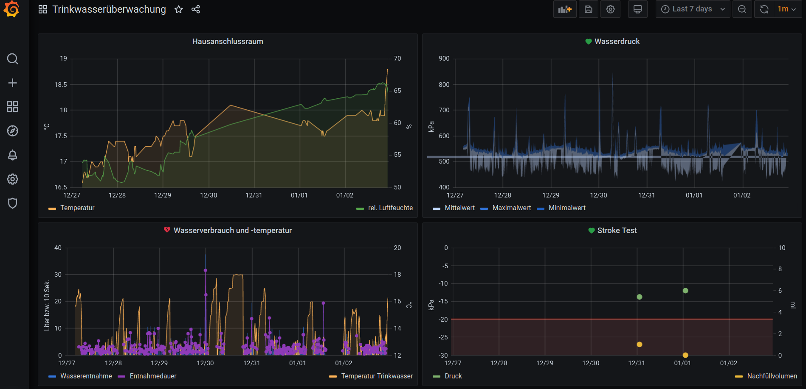
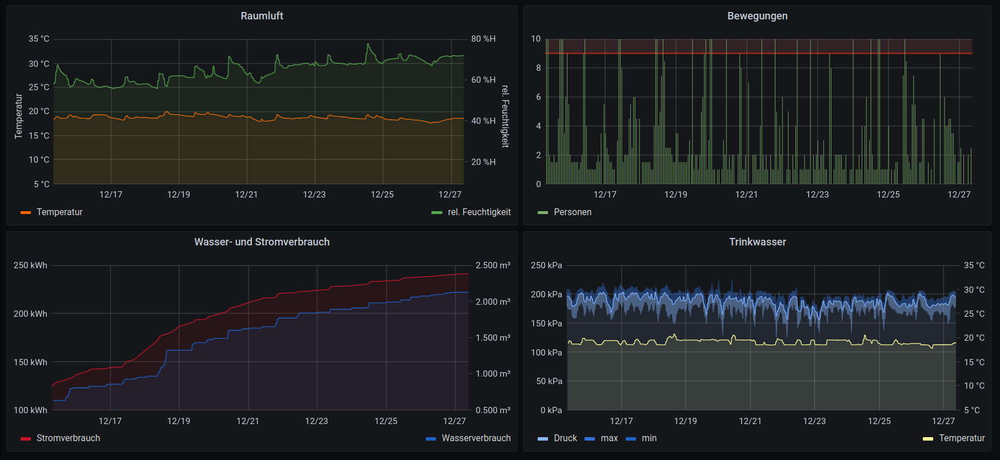
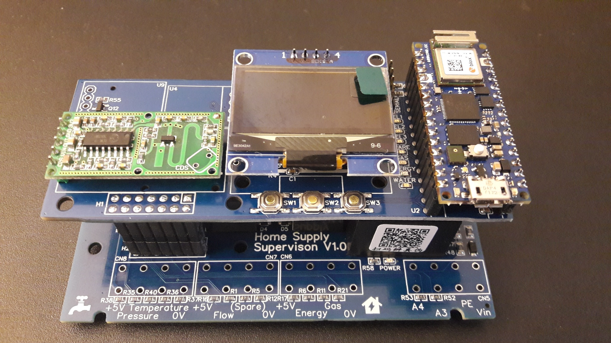
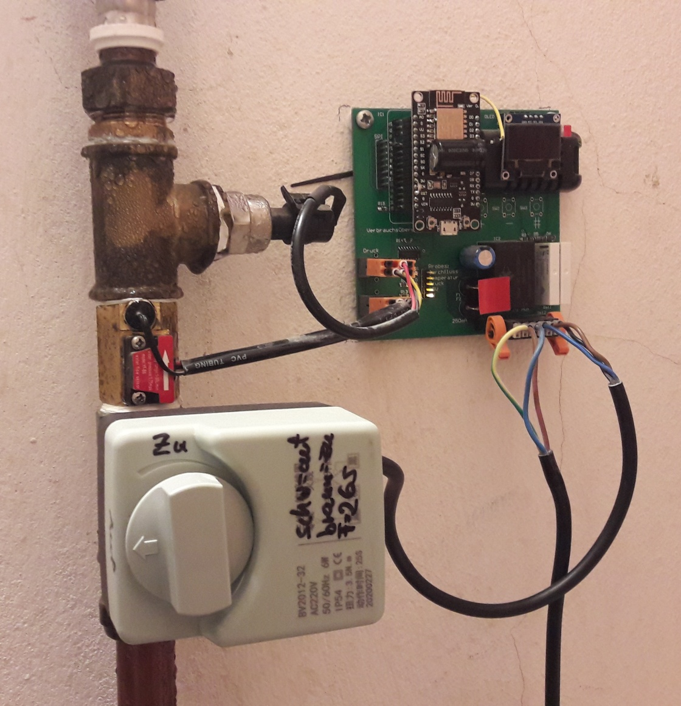
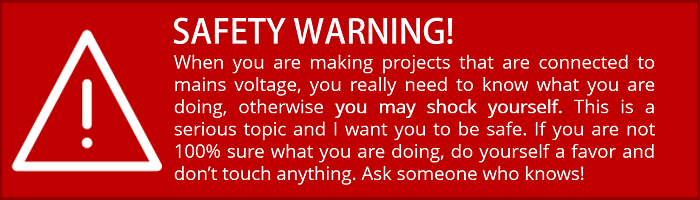

# Domestic water and energy supervisor
(Informationen in deutscher Sprache unten)

This project has two slightly different use-cases:
1. Leakage detection and comsumption counting for domestic water supply

2. Full supply supervision for a flat including water, gas, energy

Status:
- 2 old project running including full Grafana visualisation, but ESP8266 is not long-term stable

# 100 x 100 mm² 
2-layer 35µm, 1,6mm thickness, technology: 0.15mm/0.15mm/0.3mm
(5 SMD-assembled PCBs are $23.14 plus shipment/taxes @ JLCPCB 12/2021)

[Link to EasyEDA project](https://oshwlab.com/GoRoNb/watersupervisor)

# Functions
- counts water and energy consumption
- checks for water leakages
- load balancing option: drops loads in order to safe the electrical grid
- based on Arduino Nano RP2040 Connect, so reports by email, etc

- Water
- Energy
- Gas
- Presence of people
- CO/CxHx gases
- AC power switches

# Additional parts
- [water counter](https://www.aliexpress.com/item/4001114518438.html)
- [motor valve](https://www.aliexpress.com/item/4000105518976.html)
- [connectors Weidmueller LSF-SMT 5.08/04/180 3.5SN](https://catalog.weidmueller.com/catalog/Start.do?localeId=en&ObjectID=1826070000)

# Safety Warning

This project deals with mains voltage. Make sure you understand what you are doing. Please read the safety warning below carefully.

# (German copy) Überwachung der Hausversorgung

Dieses Projekt hat zwei ähnliche Anwendungsfälle:
1. Leckerkennung der häuslichen Wasserversorgung
2. Verbrauchsmessung für Strom/Gas/Energie

Zur Leckerkennung wird kontinuierlich der Wasserdruck und der Verbrauch gemessen. Wenn zu viel Wasser auf einmal entnommen wird, schiebert ein Stellmotor die Wasserzufuhr ab.

Jede Nacht wird für 3 Minuten das Wasser abgeschiebert und der Druckabfall in dieser Zeit gemessen. 

Alle Werte werden an ioBroker gesendet, der sie in einer influxDB speichert, die dann mit Grafana visualisiert wird.

# Sicherheitswarnung

Diese Projekt verwendet Netzspannung. Unvorsichtiger Umgang kann tödlich sein! Nachbau auf eigene Gefahr und nur für Leute, die wissen, was sie tun!

